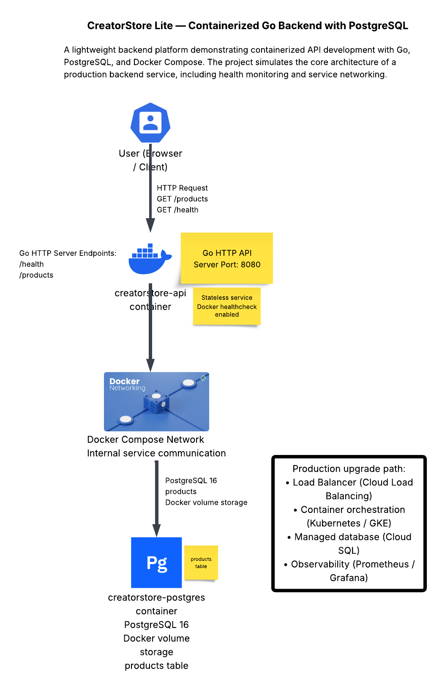
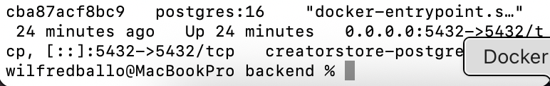
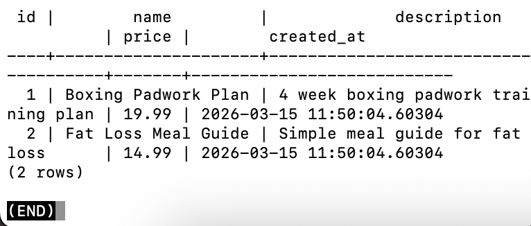
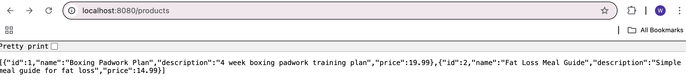
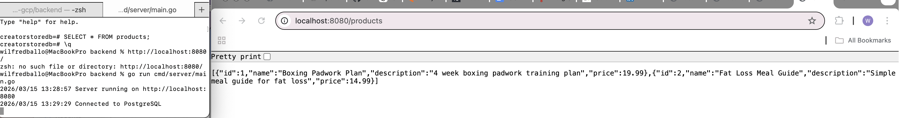
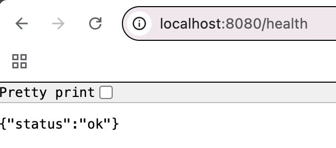
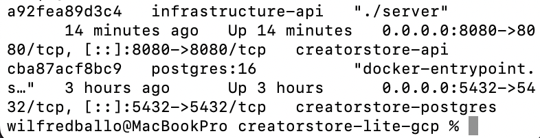
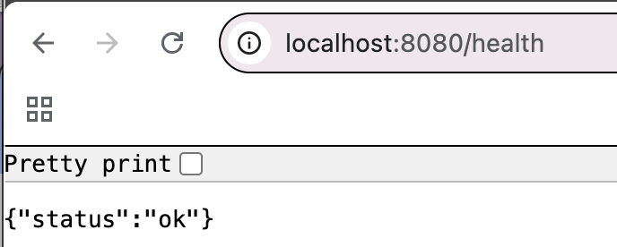
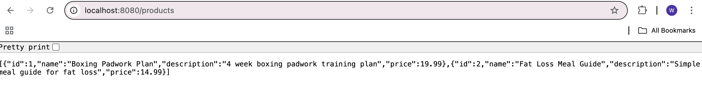
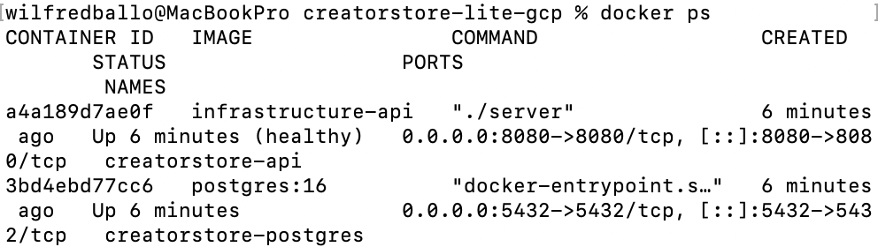

# CreatorStore Lite

A cloud-native product catalogue platform built with Go, GraphQL, PostgreSQL, Redis, Docker, Kubernetes and Google Cloud Platform.

## System Architecture

The application consists of a containerized Go API service connected to a PostgreSQL database via a Docker Compose network. The API exposes REST endpoints, uses a PostgreSQL-backed repository layer, and includes health monitoring to simulate production backend service behaviour.

## Production Architecture Considerations

This project demonstrates a containerized backend service with a database.  
In a real cloud deployment this architecture would typically be extended with:

- **Load Balancer** in front of the API for traffic distribution
- **Kubernetes (GKE)** for container orchestration and scaling
- **Managed PostgreSQL (Cloud SQL)** instead of a local container database
- **Observability tooling** such as Prometheus and Grafana
- **CI/CD pipelines** to automate container builds and deployments

This project simulates the core building blocks of a production cloud backend system.

## Project Goals
- Build a working GraphQL API in Go
- Store product data in PostgreSQL
- Improve performance with Redis caching
- Containerise the application with Docker
- Deploy on Kubernetes and Google Cloud Platform
- Provide a lightweight Typescript frontend

## Phase 2 - Basic Go Backend

The backend was scaffolded in Go using the standard `net/http` package.

### Endpoints
- `/health` - basic service health check
- `/products` - returns a mock list of products

### Evidence

Go server running:

Health endpoint:

Products endpoint:

Products endpoint:

## Phase 3 - PostgreSQL Integration

The mock product data was replaced with a PostgreSQL database running in Docker.

### What was added
- PostgreSQL container using Docker Compose
- `products` table for product catalogue data
- Go database connection using `lib/pq`
- repository layer for product queries
- `/products` endpoint now reads from PostgreSQL

### Evidence

Postgres container running:

Products table data:

Products endpoint using PostgreSQL:

API running with PostgreSQL-backed data:

## Phase 4 - Health Check Endpoint

A dedicated health endpoint was added so the service can be monitored in a production-style deployment.

### What was added
- `/health` endpoint
- service status response
- foundation for load balancer and container health checks

### Evidence

Health check endpoint:

## Phase 5 - Fully Containerized Application

The Go API was containerized and connected to PostgreSQL through Docker Compose networking.

### What was added
- Go API Dockerfile
- Docker Compose service orchestration
- service-to-service networking
- container health monitoring

### Evidence

Docker containers running:

Health endpoint from Dockerized API:

Products endpoint from Dockerized API:

Docker health monitoring:

