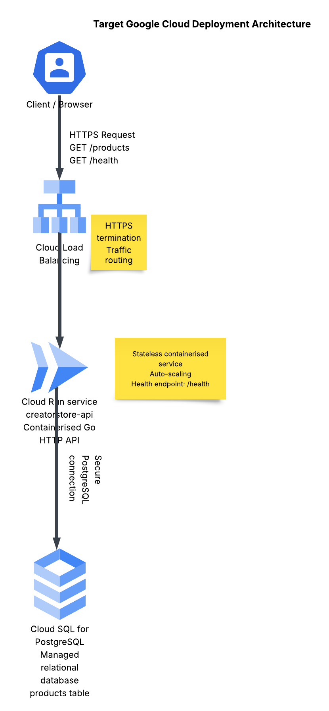

# CreatorStore Lite

CreatorStore Lite is a containerized backend product catalogue platform built with Go, PostgreSQL and Docker, demonstrating cloud-native deployment patterns on Google Cloud Platform.

The project demonstrates modern backend architecture patterns including:

- REST API development in Go
- PostgreSQL data persistence
- Docker containerization
- container health monitoring
- service-to-service networking

The repository also includes a **target Google Cloud deployment architecture** showing how the same system could be deployed using Cloud Run, Cloud SQL and Cloud Load Balancing.

## Local Container Architecture

The application consists of a containerized Go API service connected to a PostgreSQL database via a Docker Compose network. The API exposes REST endpoints, uses a PostgreSQL-backed repository layer, and includes health monitoring to simulate production backend service behaviour.

## GCP Deployment Architecture

This project was built locally with Docker Compose, but the same application pattern maps cleanly to Google Cloud Platform.

In a GCP deployment model:

- **Cloud Load Balancing** handles incoming HTTPS traffic
- **Cloud Run** hosts the containerized Go API as a stateless managed service
- **Cloud SQL for PostgreSQL** provides the managed relational database layer
- the API connects securely to the database to serve product data and health checks

This architecture shows how the project can evolve from a local containerized backend into a cloud-native deployment aligned with modern GCP application patterns.

### Why this GCP architecture matters

This deployment model improves on the local Docker setup by using managed cloud services for scaling, availability, and operational simplicity.

Key benefits include:

- managed API hosting with automatic scaling through **Cloud Run**
- managed PostgreSQL operations through **Cloud SQL**
- simplified traffic handling through **Cloud Load Balancing**
- a cleaner path toward production readiness on Google Cloud

## Production Architecture Considerations

This project demonstrates a containerized backend service with a database.  
In a real cloud deployment this architecture would typically be extended with:

- **Load Balancer** in front of the API for traffic distribution
- **Kubernetes (GKE)** for container orchestration and scaling
- **Managed PostgreSQL (Cloud SQL)** instead of a local container database
- **Observability tooling** such as Prometheus and Grafana
- **CI/CD pipelines** to automate container builds and deployments

This project simulates the core building blocks of a production cloud backend system.

### Caching Layer (Future Improvement)

In a production environment, backend services often introduce a caching layer to reduce database load and improve response times.

For this platform, a **Redis caching layer** could be placed between the API service and the PostgreSQL database.

Typical request flow:

Client → API → Redis Cache → PostgreSQL

When product catalogue data is requested, the API would first check the cache. If the data is present, it can be returned immediately without querying the database. If the data is not cached, the API queries PostgreSQL and then stores the result in Redis for future requests.

Benefits of this architecture:

- reduced database load
- faster response times for frequently requested data
- improved scalability of the API layer

In a Google Cloud deployment this caching layer would typically be implemented using **Cloud Memorystore (Redis)**.

## Project Goals

- Build a working GraphQL API in Go
- Store product data in PostgreSQL
- Improve performance with Redis caching
- Containerise the application with Docker
- Deploy on Kubernetes and Google Cloud Platform
- Provide a lightweight Typescript frontend

## Phase 2 - Basic Go Backend

The backend was scaffolded in Go using the standard `net/http` package.

### Endpoints
- `/health` - basic service health check
- `/products` - returns a mock list of products

### Evidence

Go server running:

Health endpoint:

Products endpoint:

## Phase 3 - PostgreSQL Integration

The mock product data was replaced with a PostgreSQL database running in Docker.

### What was added
- PostgreSQL container using Docker Compose
- `products` table for product catalogue data
- Go database connection using `lib/pq`
- repository layer for product queries
- `/products` endpoint now reads from PostgreSQL

### Evidence

Postgres container running:

Products table data:

Products endpoint using PostgreSQL:

API running with PostgreSQL-backed data:

## Phase 4 - Health Check Endpoint

A dedicated health endpoint was added so the service can be monitored in a production-style deployment.

### What was added
- `/health` endpoint
- service status response
- foundation for load balancer and container health checks

### Evidence

Health check endpoint:

## Phase 5 - Fully Containerized Application

The Go API was containerized and connected to PostgreSQL through Docker Compose networking.

### What was added
- Go API Dockerfile
- Docker Compose service orchestration
- service-to-service networking
- container health monitoring

### Evidence

Docker containers running:

Health endpoint from Dockerized API:

Products endpoint from Dockerized API:

Docker health monitoring:

