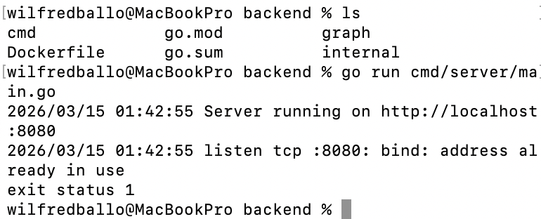
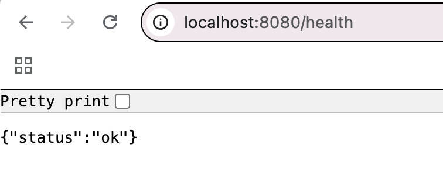
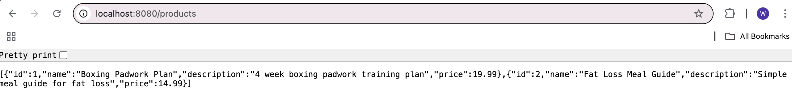

# CreatorStore Lite

A cloud-native product catalogue platform built with Go, GraphQL, PostgreSQL, Redis, Docker, Kubernetes and Google Cloud Platform.

## System Architecture

## Production Architecture Considerations

This project demonstrates a containerized backend service with a database.  
In a real cloud deployment this architecture would typically be extended with:

- **Load Balancer** in front of the API for traffic distribution
- **Kubernetes (GKE)** for container orchestration and scaling
- **Managed PostgreSQL (Cloud SQL)** instead of a local container database
- **Observability tooling** such as Prometheus and Grafana
- **CI/CD pipelines** to automate container builds and deployments

This project simulates the core building blocks of a production cloud backend system.

## Project Goals
- Build a working GraphQL API in Go
- Store product data in PostgreSQL
- Improve performance with Redis caching
- Containerise the application with Docker
- Deploy on Kubernetes and Google Cloud Platform
- Provide a lightweight Typescript frontend

## Phase 2 - Basic Go Backend

The backend was scaffolded in Go using the standard `net/http` package.

### Endpoints
- `/health` - basic service health check
- `/products` - returns a mock list of products

### Evidence

Go server running:

Health endpoint:

Products endpoint:

